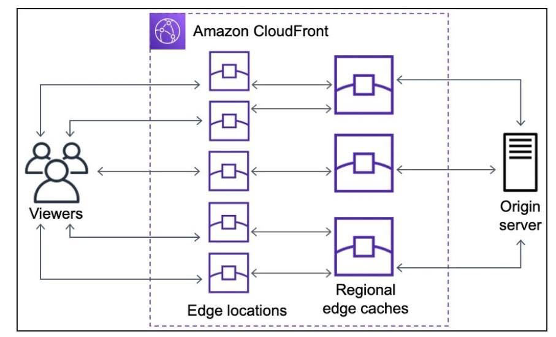

### Using Amazon CloudFront to Accelerate and Optimize Request Processing

#### 3.1.1 What is Amazon CloudFront?

CloudFront works by caching content at Edge Locations worldwide. When a user sends a request, CloudFront checks if the content is already cached at the nearest Edge Location:

* If cached (Cache Hit), CloudFront returns the data directly from the Edge Location without accessing the origin server.
* If not cached (Cache Miss), CloudFront forwards the request to the Origin (e.g., Amazon S3, API Gateway, or Application Load Balancer), retrieves the data, returns it to the user, and caches it for subsequent requests.

This mechanism reduces response time and significantly improves user experience globally.

#### 3.1.2 Key Benefits

* **Low Latency** — Users receive data from the nearest Edge Location instead of connecting directly to a distant origin.
* **Faster Content Loading** — Frequently accessed content is cached at Edge Locations, providing much faster responses.
* **Reduced Origin Load** — When many users access the same content, most requests are served from cache, reducing requests to the origin.
* **Cost Savings** — Fewer origin requests reduce request-based or bandwidth costs of backend services.
* **Enhanced Security** — CloudFront integrates with AWS WAF to filter malicious requests before they reach the application.

#### 3.1.3 Ideal Use Cases

* Distributing static websites hosted on Amazon S3.
* Accelerating APIs when combined with Amazon API Gateway.
* Delivering images, videos, and multimedia content.
* Distributing downloadable files such as software, documents, or updates.
* Supporting high-traffic web applications that need to offload the origin server.

#### 3.1.4 Practical Example

Consider an e-commerce website storing all product images on Amazon S3 and using CloudFront for content delivery.

When the first customer accesses a product image:

1. The request is sent to CloudFront.
2. CloudFront does not find the image in cache (Cache Miss).
3. CloudFront fetches the image from Amazon S3.
4. The image is returned to the user and cached at the Edge Location.

Subsequent customers in the same region will receive the data directly from the Edge Location (Cache Hit) without accessing Amazon S3 again.

Results:

* Images load faster.
* Amazon S3 receives fewer requests.
* The website remains stable even under high traffic.

#### 3.1.5 Conclusion

Amazon CloudFront not only accelerates content delivery but also reduces origin load, optimizes operational costs, and can be combined with AWS WAF for enhanced security. It is a valuable service for web applications and serverless architectures on AWS, especially for systems that need to scale and serve users across multiple regions.

**Reference:** [https://aws.amazon.com/vi/blogs/networking-and-content-delivery/charting-the-life-of-an-amazon-cloudfront-request/](https://aws.amazon.com/vi/blogs/networking-and-content-delivery/charting-the-life-of-an-amazon-cloudfront-request/)
