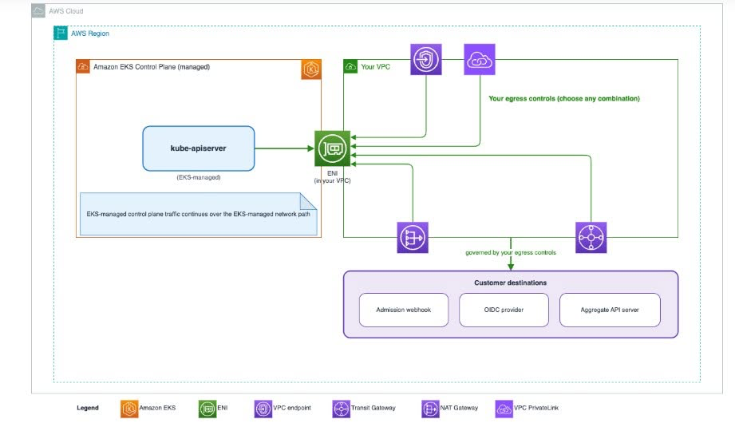

### Amazon EKS Hỗ Trợ Truyền Dữ Liệu Từ Mặt Phẳng Điều Khiển Thông Qua VPC Của Bạn

Trong quá trình tìm hiểu về Amazon EKS, mình thấy AWS vừa giới thiệu tính năng Customer-Routed Control Plane Egress. Tính năng này cho phép lưu lượng từ Control Plane của Kubernetes được định tuyến thông qua Amazon VPC của khách hàng, giúp tăng khả năng kiểm soát và bảo mật hệ thống.

#### 3.2.1 Amazon EKS là gì?

Amazon Elastic Kubernetes Service (Amazon EKS) là dịch vụ Kubernetes được AWS quản lý. Dịch vụ này giúp người dùng triển khai và vận hành Kubernetes dễ dàng hơn mà không cần tự quản lý Control Plane. Ngoài ra, EKS còn tích hợp với nhiều dịch vụ AWS như IAM, VPC và CloudWatch để hỗ trợ quản lý và giám sát hệ thống.

#### 3.2.2 Điểm mới của tính năng

Trước đây, lưu lượng từ Kubernetes Control Plane được xử lý theo hạ tầng mạng do AWS quản lý. Với tính năng mới, lưu lượng này có thể đi qua chính Amazon VPC của khách hàng thông qua Elastic Network Interface (ENI). Nhờ đó, người quản trị có thể áp dụng các công cụ như Security Group, Route Table, VPC Endpoint hoặc AWS Network Firewall để kiểm soát lưu lượng mạng tốt hơn.

#### 3.2.3 Lợi ích

Theo mình, tính năng này mang lại nhiều lợi ích như:

* Tăng khả năng kiểm soát lưu lượng mạng.
* Nâng cao tính bảo mật cho hệ thống.
* Hỗ trợ đáp ứng các yêu cầu về kiểm toán và tuân thủ.
* Thuận tiện khi sử dụng các dịch vụ xác thực hoặc hệ thống nội bộ.

#### 3.2.4 Một số lưu ý

Khi sử dụng chế độ CUSTOMER_ROUTED, người quản trị cần cấu hình mạng chính xác vì việc định tuyến sẽ do doanh nghiệp tự quản lý. Do đó, nên kiểm tra kỹ trước khi triển khai trên môi trường thực tế.

#### 3.2.5 Đánh giá cá nhân

Theo mình, đây là một cập nhật khá hữu ích của Amazon EKS. Tính năng này giúp doanh nghiệp chủ động hơn trong việc quản lý lưu lượng và tăng cường bảo mật khi triển khai Kubernetes trên AWS. Đối với sinh viên đang tìm hiểu về Cloud như mình, đây cũng là cơ hội để hiểu rõ hơn cách AWS liên tục cải tiến các dịch vụ nhằm đáp ứng nhu cầu thực tế của người dùng.

#### 3.2.6 Kết luận

Customer-Routed Control Plane Egress là một cải tiến đáng chú ý của Amazon EKS. Việc cho phép định tuyến lưu lượng Control Plane thông qua Amazon VPC giúp hệ thống linh hoạt, an toàn và dễ quản lý hơn. Mình tin rằng tính năng này sẽ được nhiều doanh nghiệp áp dụng khi triển khai Kubernetes trên AWS trong thời gian tới.

Nguồn tham khảo: https://aws.amazon.com/vi/blogs/containers/amazon-eks-now-supports-control-plane-egress-through-your-vpc/
