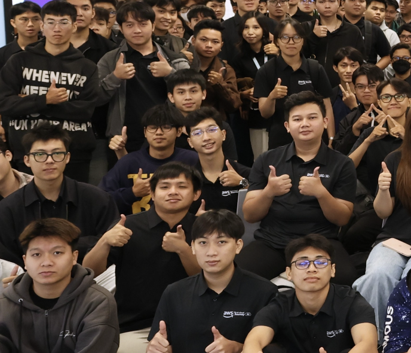

# Report on FCAJ Community Day

| Info     | Details                                                                                 |
| -------- | --------------------------------------------------------------------------------------- |
| Date     | 30/05/2026                                                                              |
| Location | 26th Floor, Bitexco Building, 02 Hai Trieu, Ben Nghe Ward, District 1, Ho Chi Minh City |
| Role     | Attendee                                                                                |

## 4.2.1 Purpose of the Event

The sharing session covered various topics aimed at providing attendees with practical learning methods, hands-on experiences from hackathons and real projects, as well as mindset and soft skills for studying and working in the IT field.

## 4.2.2 Speaker List

* **Mr. Hoang Thai Linh** – Topic: *Learning AWS through Cloud Quest and Floci*.
* **Mr. Nguyen Tran Minh Quan, Mr. An Khuong Huynh & Mr. Quoc Anh Mai** – Topic: *Experience from LotusHacks 2026*.
* **Ms. Nguyen Thi Quynh Nhu** – Topic: *Confidence in Learning and Work*.
* **Mr. Tran Nghia** – Topic: *Tu Vi Dai Viet Application and Migration to AWS*.
* **Mr. Tran Minh Quan** – Topic: *DevOps and Hidden Issues in Projects*.
* **Mr. Pham Khac Uy** – Topic: *Understanding Procrastination*.

## 4.2.3 Notable Content

### Learning AWS through Cloud Quest and Floci

The speaker introduced a practical approach to learning AWS using **AWS Cloud Quest** – a 3D role-playing game that helps learners build AWS infrastructure through real-world scenarios, and **Floci** – a tool that supports learning by providing hands-on AWS environments while minimizing the risk of unexpected costs.

This approach helps beginners access AWS more easily through visual, interactive exercises without worrying about complex configurations or incurring unnecessary expenses.

### Experience from LotusHacks 2026

The team shared their journey participating in **LotusHacks 2026**, a prominent hackathon for university students. They presented the process of building projects such as **SynthHunter** and **Vortex**, from ideation to a Minimum Viable Product (MVP) within a very short timeframe.

Key takeaways included how to effectively divide tasks under time pressure, select appropriate technologies for rapid prototyping, and the importance of teamwork and clear communication during the hackathon.

### Confidence in Learning and Work

The talk focused on building self-confidence in both academic and professional environments. The key message was that confidence is not the absence of fear, but the willingness to try despite feeling anxious.

The speaker encouraged attendees to step out of their comfort zones, embrace failure as a learning opportunity, and gradually build confidence through small achievements.

### Tu Vi Dai Viet Application and Migration to AWS

The speaker shared the real-world journey of building the **Tu Vi Dai Viet** (Vietnamese Astrology) application and migrating its system to AWS. This session helped me understand more about:

* **Serverless architecture** and how it reduces operational overhead.
* **Managed Services** on AWS that simplify infrastructure management.
* **Cost optimization strategies** for startups, including using Lambda, API Gateway, and DynamoDB to minimize costs while maintaining scalability.

### DevOps and Hidden Issues in Projects

The presentation emphasized that **DevOps is not just about tools** – it also involves people, processes, and teamwork. The speaker highlighted common hidden issues in projects such as:

* Lack of clear communication between development and operations teams.
* Siloed workflows that slow down delivery.
* Over-reliance on automation without understanding the underlying processes.

A successful DevOps culture requires a mindset shift across the entire team, not just the adoption of CI/CD pipelines or infrastructure-as-code tools.

### Understanding Procrastination

The final talk offered a fresh perspective on procrastination, showing that it is often not simply due to laziness. Instead, procrastination can stem from:

* **Fear of failure** – avoiding tasks to protect oneself from potential disappointment.
* **Fear of judgment** – worrying about how others will evaluate the outcome.
* **Lack of confidence** – doubting one's own ability to complete the task.

The speaker suggested breaking tasks into smaller steps, setting realistic goals, and practicing self-compassion to overcome procrastination.

## 4.2.4 Lessons Learned and Application Direction

* Explore **AWS Cloud Quest** and **Floci** as practical tools for hands-on AWS learning without cost risks.
* Apply lessons from LotusHacks 2026 when working on time-constrained projects: prioritize MVP features, divide tasks efficiently, and maintain clear communication.
* Build confidence by taking action despite fear, starting with small achievable goals.
* Study Serverless and Managed Services on AWS for cost-effective solutions, especially when building applications for startups.
* Adopt DevOps as a culture involving people and processes, not just automation tools.
* Recognize the root causes of procrastination and apply practical strategies to overcome them.

## 4.4.5 Event Attendance Evidence

