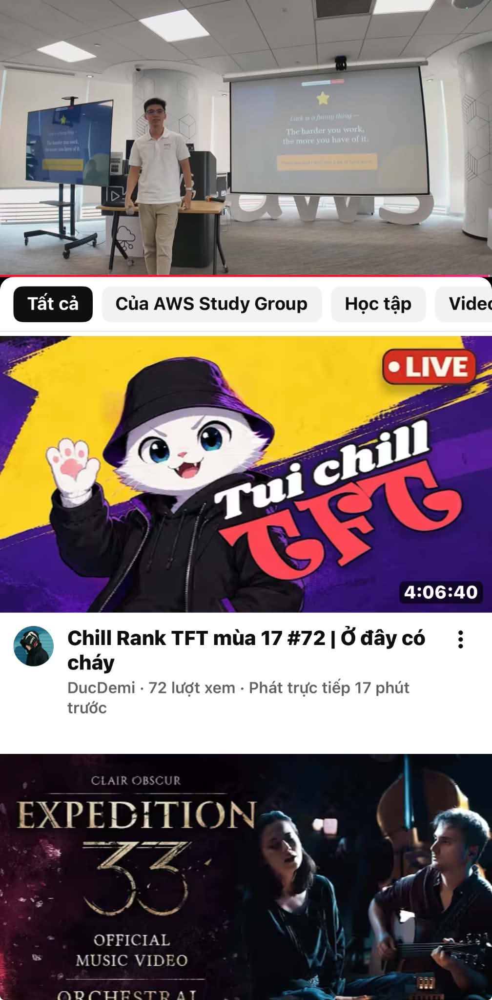

# Bài thu hoạch sự kiện FCAJ Community Day

| Thông tin   | Chi tiết                                                                                   |
| ------------ | ------------------------------------------------------------------------------------------- |
| Ngày        | 4/7/2026                                                                                    |
| Địa điểm | Tầng 26 Tòa nhà Bitexco, 02 Hải Triều, Phường Bến Nghé, Quận 1, TP Hồ Chí Minh  |
| Vai trò     | Người tham gia                                                                            |

#### 4.3.1 Mục Đích Của Sự Kiện

Sự kiện được tổ chức nhằm tạo điều kiện cho sinh viên Swinburne Việt Nam có cơ hội tiếp cận với môi trường làm việc thực tế trong lĩnh vực điện toán đám mây (Cloud Computing), từ đó hiểu rõ hơn về cách các doanh nghiệp hiện nay xây dựng, vận hành và phát triển hệ thống ứng dụng trên nền tảng Cloud. Bên cạnh đó, chương trình còn là cầu nối giúp sinh viên giao lưu, kết nối trực tiếp với các chuyên gia đang làm việc trong ngành thông qua cộng đồng  **AWS First Cloud AI Journey** , tạo cơ hội học hỏi kinh nghiệm thực tiễn, định hướng nghề nghiệp và cập nhật những xu hướng công nghệ mới nhất.

#### 4.3.2 Danh Sách Diễn Giả

* **Mr. Nguyen Gia Hung** – Head of Solutions Architects in Vietnam & Cambodia, Amazon Web Services.
* **Mr. Khang Nguyen** – Solutions Architect, Cloud Kinetics.
* **Ms. Nhu Tran** – Account Manager, Amazon Web Services.
* **Mr. Vinh Banh** – Senior Data Engineer, Renova Cloud.

#### 4.3.3 Nội Dung Nổi Bật

##### Mr. Nguyen Gia Hung – Toàn cảnh thị trường và xu hướng nghề nghiệp trong lĩnh vực Cloud Computing

Ông chia sẻ bức tranh tổng quan về thị trường công nghệ thông tin hiện nay, đồng thời phân tích những thay đổi lớn trong nhu cầu tuyển dụng của doanh nghiệp.

* Thị trường việc làm IT đang ngày càng cạnh tranh khốc liệt. Ngay cả đối với các vị trí thực tập sinh, doanh nghiệp cũng đặt ra những yêu cầu chuyên môn tương đối cao, điển hình là khả năng làm việc với Kubernetes (K8S) và các công nghệ hiện đại.
* Cloud Computing đã trở thành xu hướng phát triển tất yếu của ngành công nghệ. Quy mô thị trường Cloud hiện nay đã vượt xa lĩnh vực phần cứng truyền thống, đồng thời hầu hết các doanh nghiệp lớn đều ưu tiên chiến lược **Cloud First** khi thiết kế và triển khai hệ thống.
* Sự phát triển mạnh mẽ của AI cũng làm thay đổi yêu cầu đối với nguồn nhân lực. Các kỹ sư trẻ cần liên tục nâng cao năng lực chuyên môn và khả năng giải quyết các bài toán phức tạp để đáp ứng kỳ vọng ngày càng cao của doanh nghiệp.

##### Mr. Vinh Banh – Sự khác biệt giữa môi trường học tập và môi trường làm việc thực tế

Thông qua những kinh nghiệm thực tiễn trong lĩnh vực Data Engineering, ông đã chỉ ra nhiều khác biệt giữa việc học trên giảng đường và công việc tại doanh nghiệp.

* Trong môi trường học tập, dữ liệu thường đã được chuẩn hóa, yêu cầu bài toán rõ ràng và người học có nhiều thời gian để hoàn thành. Trong khi đó, môi trường thực tế đòi hỏi phải xử lý dữ liệu đến từ nhiều nguồn khác nhau, yêu cầu nghiệp vụ thay đổi liên tục và áp lực về thời gian luôn rất lớn.
* Việc học cần tập trung vào bản chất của các framework và nguyên lý hoạt động thay vì chỉ ghi nhớ cách sử dụng các công cụ.
* AI sẽ trở thành công cụ hỗ trợ giúp tăng năng suất làm việc chứ không thể thay thế hoàn toàn con người. Khả năng thấu hiểu nghiệp vụ, tư duy phân tích và kỹ năng giao tiếp vẫn là những yếu tố mang tính khác biệt mà AI khó có thể thay thế.

##### Ms. Nhu Tran – Vượt qua nỗi sợ và chủ động nắm bắt cơ hội

Bài chia sẻ tập trung vào những kỹ năng mềm cần thiết để sinh viên có thể thích nghi và phát triển trong môi trường doanh nghiệp.

* Sinh viên cần học cách vượt qua tâm lý sợ mắc sai lầm cũng như áp lực từ sự đánh giá của người khác để mạnh dạn thử sức với những cơ hội mới.
* Kỹ năng giao tiếp đóng vai trò vô cùng quan trọng trong công việc, giúp hạn chế những hiểu lầm không đáng có và nâng cao hiệu quả phối hợp giữa các thành viên trong nhóm.
* Việc chủ động tạo sự hiện diện thông qua những cuộc trò chuyện ngắn hoặc các hoạt động trao đổi hằng ngày sẽ giúp xây dựng mối quan hệ tốt hơn với đồng nghiệp và cấp trên.

##### Mr. Khang Nguyen – Kỹ năng, tư duy và áp lực từ sự phát triển của AI

Phần chia sẻ nhấn mạnh vai trò của tư duy học tập và thái độ làm việc trong bối cảnh AI ngày càng phát triển mạnh mẽ.

* AI là công cụ hữu ích giúp sinh viên học tập và giải quyết bài tập hiệu quả hơn, tuy nhiên không nên phụ thuộc hoàn toàn vào AI mà cần tự mình rèn luyện tư duy phân tích và khả năng giải quyết vấn đề.
* Điều quan trọng nhất là phải hiểu được bản chất của kiến thức thay vì chỉ quan tâm đến kết quả đầu ra.
* Đối với các vị trí Fresher, nhà tuyển dụng thường đánh giá ứng viên dựa trên thái độ học hỏi và tinh thần cầu tiến trước tiên, sau đó mới đến năng lực chuyên môn và kinh nghiệm thực tế.

#### 4.3.4 Những Gì Học Được

Sau khi tham gia sự kiện, em rút ra được nhiều bài học hữu ích không chỉ về kiến thức chuyên môn mà còn về định hướng phát triển nghề nghiệp trong tương lai.

* **Chủ động xây dựng sự hiện diện cá nhân:** Bên cạnh việc trau dồi kỹ năng chuyên môn, sinh viên cần tích cực tham gia các cộng đồng công nghệ, mở rộng mạng lưới quan hệ và chủ động kết nối với những người đang làm việc trong ngành để tạo thêm nhiều cơ hội học hỏi và phát triển.
* **Đầu tư vào giá trị lâu dài:** Việc không ngừng học hỏi, cập nhật công nghệ mới và duy trì tinh thần học tập suốt đời sẽ giúp nâng cao năng lực cạnh tranh và tạo lợi thế khi tham gia thị trường lao động.
* **Mở rộng góc nhìn về nghiệp vụ:** Khi định hướng nghề nghiệp, không nên chỉ tập trung vào kiến thức kỹ thuật mà còn cần trang bị hiểu biết về đặc thù nghiệp vụ của từng lĩnh vực, từ đó có thể xây dựng các giải pháp công nghệ phù hợp với nhu cầu thực tế của doanh nghiệp.

#### Minh chứng tham gia sự kiện

